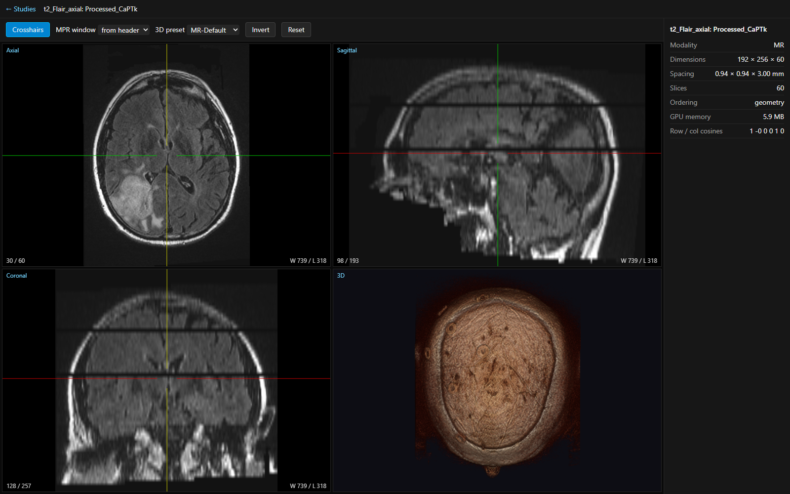
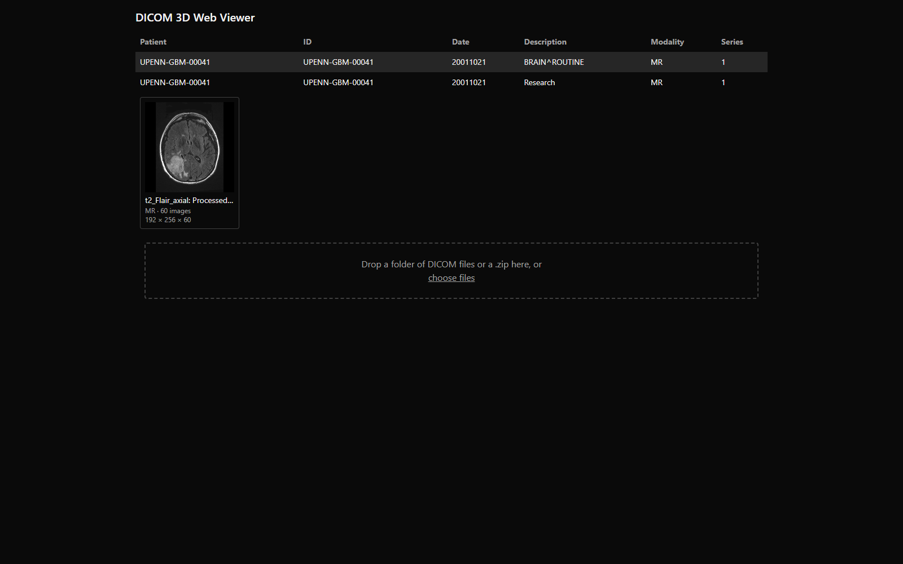
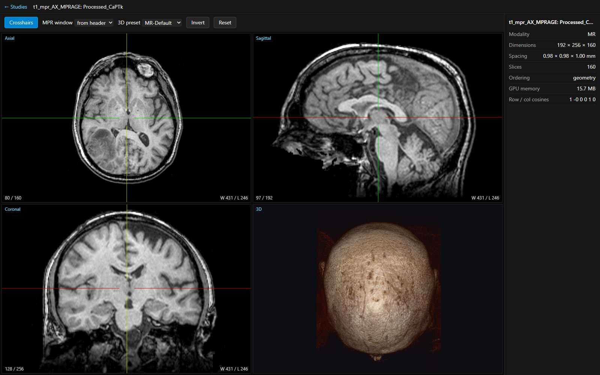

# DICOM 3D Brain Viewer

Browser-based 3D viewer for brain MR studies: multiplanar reconstruction (axial /
sagittal / coronal) with synchronized crosshairs and GPU volume rendering, served
from a Python backend that speaks DICOMweb.



The screenshot is a real T2-FLAIR brain MR from the public UPENN-GBM collection —
the bright mass in the right temporal lobe is the patient's glioblastoma. All four
panels are driven from one volume in GPU memory; the crosshairs in any plane move
the other two.

## Architecture

```
┌───────────────────────────────────┐      DICOMweb (HTTP/JSON + binary)         ┌──────────────────────────────┐
│  frontend/  (React + Vite)        │ ── QIDO-RS  /dicomweb/studies ...   ─────▶ │  backend/  (FastAPI, Python) │
│  Cornerstone3D core + tools       │ ── WADO-RS  .../metadata, .../frames/N ──▶ │  pydicom · numpy · SQLite    │
│  streaming volume loader (wadors) │ ── GET /api/series/{uid}/volume-info ────▶ │  ingest → validate → index   │
│  MPR ×3 + VOLUME_3D viewports     │ ── POST /api/upload (multi-file / zip) ──▶ │  → serve                     │
└───────────────────────────────────┘                                            └──────────────┬───────────────┘
                                                                                                │
                                                                            data/store/<StudyUID>/<SeriesUID>/<SOPUID>.dcm
                                                                            data/store/index.sqlite  (study/series/instance)
```

**backend/** — FastAPI + pydicom. Ingests DICOM (validating UIDs, decoding compressed
transfer syntaxes once at ingest), decides whether each series forms a regular 3D grid,
indexes it into SQLite, and serves it over a DICOMweb subset.

**frontend/** — React 19 + Vite + TypeScript + Tailwind on **Cornerstone3D** (the engine
behind OHIF). Cornerstone's streaming volume loader reads the backend's WADO-RS endpoints
directly; the app contains no DICOM parsing of its own.

More detail: [architecture](docs/architecture.md) · [data flow](docs/data-flow.md) ·
[technical requirements](docs/trd.md).

## Screenshots

| Study browser | T1 MPRAGE (JPEG 2000) |
|---|---|
|  |  |

## Run it

The backend listens on **8001** (8000 is commonly taken by Windows' `iphlpsvc`).

```powershell
cd backend; python -m venv .venv; .\.venv\Scripts\Activate.ps1; pip install -e ".[dev]"
python ..\scripts\fetch_samples.py      # ~22 MB of public brain MR (credits below)
cd ..\frontend; npm install
cd ..; .\scripts\dev.ps1                # backend :8001 + Vite :5173
```

Then open http://localhost:5173.

You can also drag a folder of your own DICOM files (or a `.zip`) onto the study browser.
Files that aren't DICOM, or series that aren't a regular volume, are skipped with a
stated reason rather than failing the upload.

## Tests

```powershell
.\scripts\test.ps1          # backend pytest + ruff + mypy, then frontend vitest
cd frontend; npm run e2e    # Playwright: loads a synthetic series and drives the viewer
```

83 backend tests, 36 frontend tests, 1 end-to-end test. The e2e test starts its own
backend against a synthetic DICOM series, so it needs no sample data and no network.

## DICOM standards implemented

- **QIDO-RS** — study / series / instance search with `PatientName`, `PatientID`,
  `StudyDate` filters and paging.
- **WADO-RS** — `metadata` (sorted, with an `X-Sort-Method` header), `frames/{n}`
  as `multipart/related`, full instance retrieval, and `rendered` PNG thumbnails.
- **DICOM JSON model** (PS3.18 Annex F) — PN component splitting, empty elements,
  bulk-data omission, correct numeric typing, sequence recursion.
- **Transfer syntax normalisation** — JPEG 2000 / JPEG-LS / RLE are decoded once at
  ingest and stored as Explicit VR Little Endian, so frame retrieval is a byte slice.
  SOP Instance UIDs are preserved across decoding.
- **Slice geometry** — anatomical ordering by the projection of `ImagePositionPatient`
  onto the slice normal derived from `ImageOrientationPatient`, with documented
  fallbacks.
- **Volume validation** — a series is only openable if it forms a regular 3D grid
  (consistent dimensions, single orientation, uniform slice spacing); otherwise the
  browser greys it out and says why.

## Sample data

Two brain MR series from the same patient in the public **UPENN-GBM** collection
(`UPENN-GBM-00041`):

- **T1 MPRAGE**, 160 slices — transcoded to JPEG 2000 Lossless by the fetch script, so
  the compressed-decode path runs on real data.
- **T2-FLAIR**, 60 slices — kept uncompressed.

UPENN-GBM is licensed CC BY 4.0 — https://doi.org/10.7937/TCIA.709X-DN49.
Data courtesy of [The Cancer Imaging Archive](https://www.cancerimagingarchive.net/).
Nothing binary is committed; `scripts/fetch_samples.py` downloads and verifies both
series against `scripts/samples.json`.

## Scope

v1 is brain-focused: brain MR samples and brain-oriented window/transfer-function
presets. The backend itself is modality-agnostic — it validates geometry, not anatomy.

Not included: measurements and annotations, segmentation, surface (mesh) rendering,
hanging protocols, authentication, or hosting. It runs locally.

## Roadmap

Measurements (length / angle / probe) · labelmap segmentation · marching-cubes surface
export.
